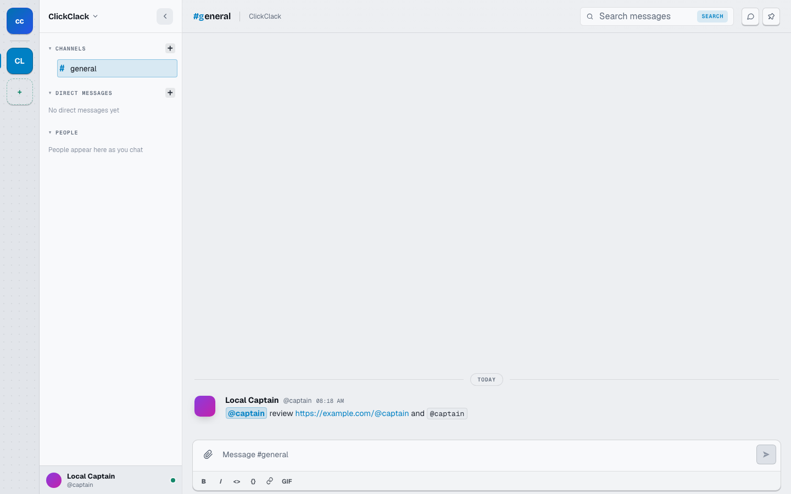

# Semantic mention highlighting — live behavior proof

This proof uses the real ClickClack Go API on a temporary local SQLite data
directory and the changed Vite web client.

## Scenario

1. Set the local signed-in user handle to `captain`.
2. Post `@captain review https://example.com/@captain and \`@captain\`` to
   `#general` through the live API.
3. Reload the changed web client and inspect the rendered message.

## Observed result

- The real `@captain` mention is highlighted with the ClickClack mention style.
- The `@captain` inside the URL path is not highlighted.
- The code-formatted `@captain` is not highlighted.
- Browser DOM inspection found exactly one
  `[data-clickclack-mention]` element with text `@captain`.

